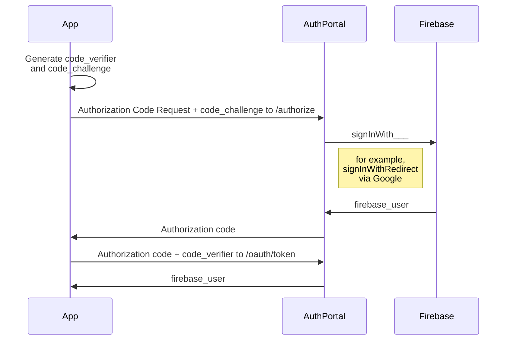

# AuthPortal Flow Specification

The AuthPortal Flow is the mechanism with which Apps obtain a Firebase User from AuthPortal.

The following is a visualization of the AuthPortal Flow:

```mermaid
sequenceDiagram
    App->>App: Generate code_verifier <br/> and code_challenge
    App->>AuthPortal: Authorization Code Request + code_challenge to /authorize
    AuthPortal->>Firebase: signInWith___
    Note left of Firebase: for example, <br />signInWithRedirect<br />via Google
    Firebase->>AuthPortal: firebase_user
    AuthPortal->>App: Authorization code
    App->>AuthPortal: Authorization code + code_verifier to /oauth/token
    AuthPortal->>App: firebase_user
```
