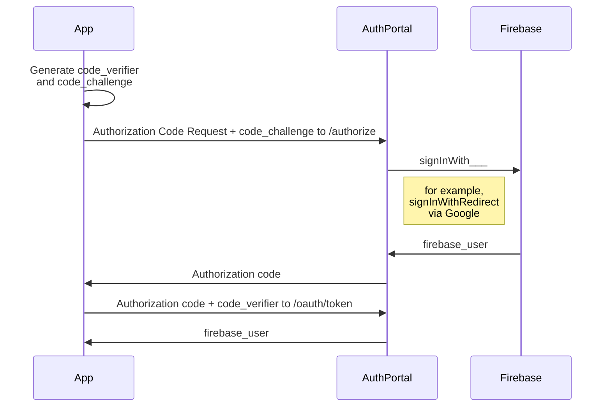

# AuthPortal Flow Specification

The AuthPortal Flow is the mechanism with which Apps obtain a Firebase User from AuthPortal.

The easiest way to implement AuthPortal Flow in your client application is by using the SDK. Follow the [Getting Started](./GettingStarted.md) guide for instructions. You do not need to understand this document in order to integrate AuthPortal in your project.

The following is a visualization of the AuthPortal Flow:



## Step 1: Generate code_verifier and code_challenge

Generate code_verifier and code_challenge as follows:

```
code_verifier = BASE64URL-ENCODE(random 32 bytes)
code_challenge = BASE64URL-ENCODE(SHA256(ascii(code_verifier)))
```

Do not reuse the same `code_verifier` and `code_challenge`, a new pair must be generated for every authentication attempt.

## Step 2: Redirect Users To Authorization Endpoint

The Authorization Endpoint is as follows:

```
GET https://<domain>/authorize
  ?response_type=code
  &client_id=<client_id>
  &code_challenge=<code_challenge>
  &code_challenge_method=S256
  &scope=firebase_auth
  &redirect_uri=<redirect_uri>
```

You obtain your `<domain>` as well as `<client_id>` after registering with AuthPortal. All `<redirect_uri>`s must be identical to those previously registered with AuthPortal. You may optionally pass an optional `state` parameter, which will be returned to the `redirect_uri`.

Redirect your users to the authorization endpoint, where they will be prompted to log in.

## Step 3: Handle Redirect & Call Token Endpoint

After successful login, AuthPortal redirect users back to `<redirect_uri>`, and two query parameters will be set: `code` and `iss`. If `state` was provided in the query above, it will also be set. You must verify that the `iss` matches `https://<domain>`.

To obtain the firebase user object, a final background API call to the Token Endpoint is necessary. Obtain the stored `code_challenge` and make the following HTTP POST API call:

```
POST https://<domain>/oauth/token
  ?grant_type=authorization_code
  &client_id=<client_id>
  &redirect_uri=<redirect_uri>
  &code=<code>
  &code_verifier=<code_verifier>
```

The result will look like this:

```js
{
  "access_token": "random token, can be ignored",
  "token_type": "Bearer",
  "firebase_user": { /* <firebase user serialized as JSON> */ }
}
```

You can use the firebase-js-sdk to initialize firebase authentication with the data provided in the serialized firebase user.

## OAuth 2.0 Compatibility

AuthPortal Flow is based on OAuth 2.0 Authorization Code Flow (as per RFC6749). It extends OAuth 2.0 by requiring a `scope=firebase_user` parameter, which returns a `firebase_user` object in the token response after successful authorization. PKCE (as per RFC7636) is mandatory. `iss` (as per RFC9207) is always returned.